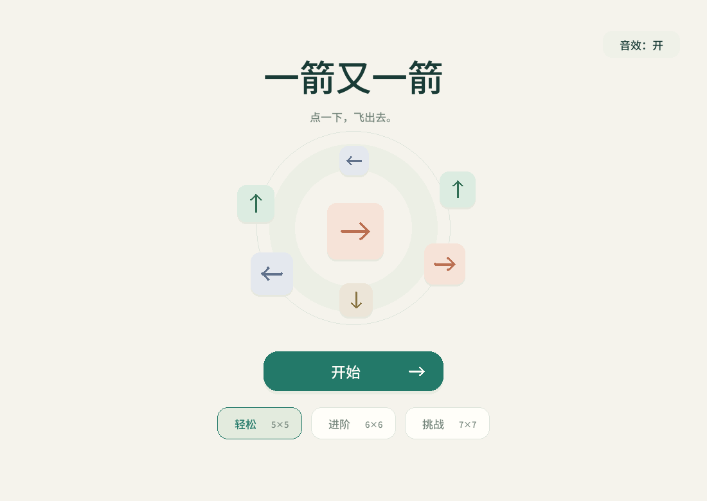
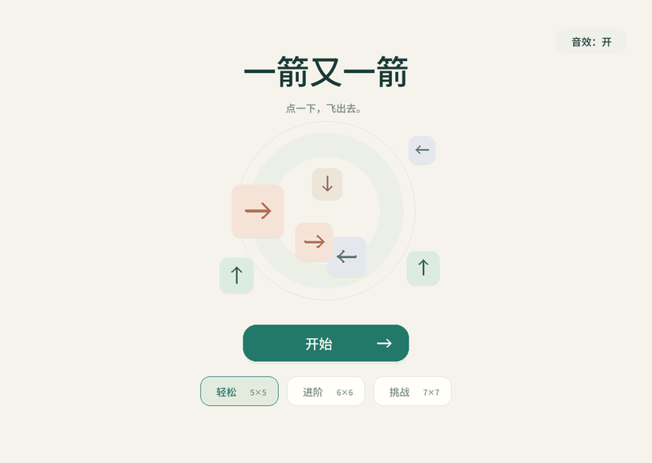
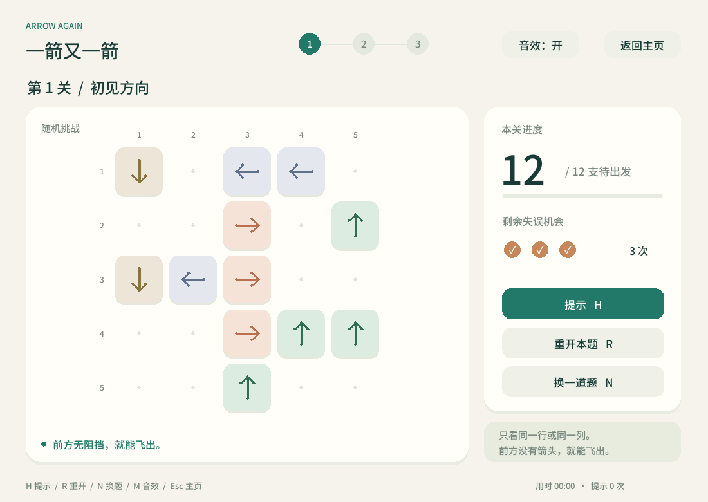
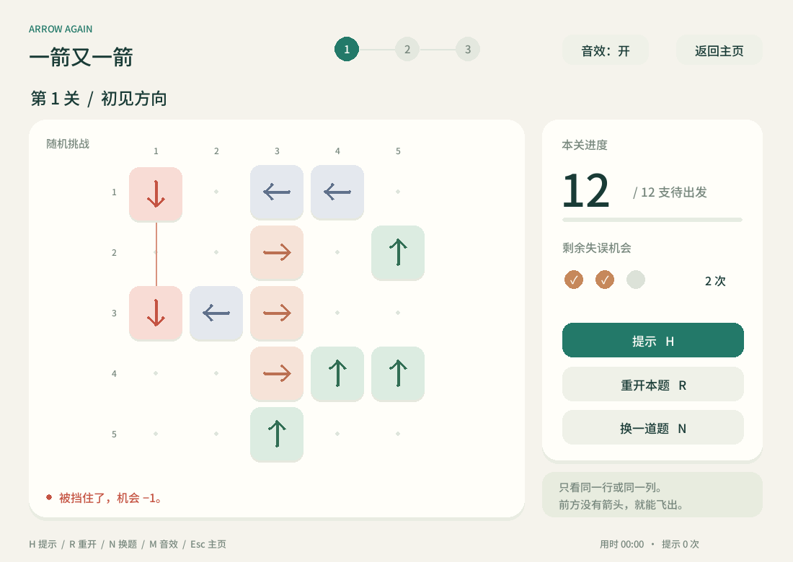
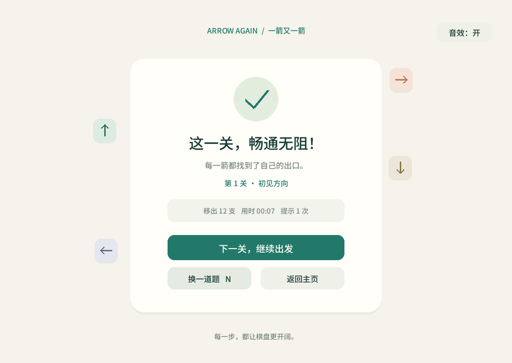
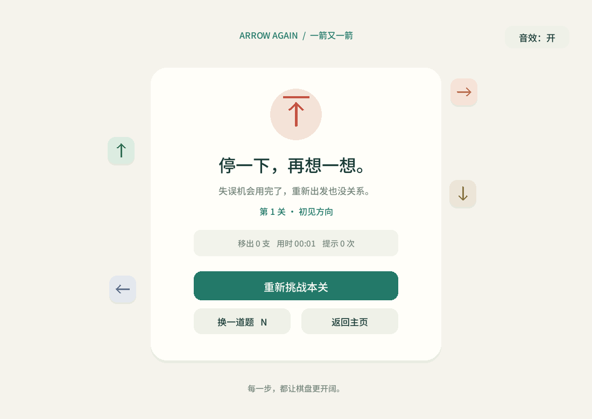
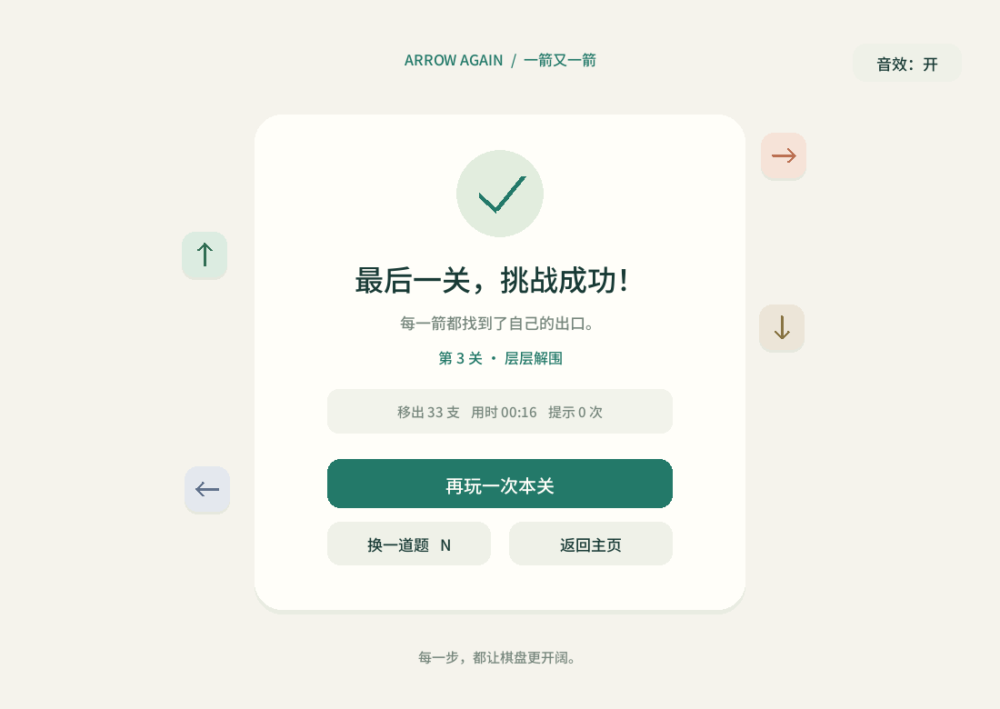

# 一箭又一箭 · Arrow Again v2

使用 **Python + Pygame** 开发的单格箭头解谜小游戏。观察箭头的朝向，按合适的顺序点击，让所有箭头飞出棋盘。项目用于软件工程课程第二次个人作业，开发中使用了 OpenAI Codex。

第二版增加了**随机出题、换题和点击音效**。每次开始或进入下一关都会生成可解的新布局；重开保留本题，换题重新生成。



主页采用精简的居中布局。打开时小箭头轻轻归位，点击可飞出；进入游戏时棋盘箭头依次落下，首次点击立即结束入场并执行操作。



## 游戏规则与功能

- 每个有箭头的格子只占一格，箭头有上、下、左、右四个方向。
- 点击箭头后，检测它前方同一行或同一列直到棋盘边缘的全部格子。
- 没有其他箭头阻挡：箭头飞出棋盘，剩余箭头数量减一。
- 有其他箭头阻挡：显示碰撞反馈，保留箭头，并扣除一次失误机会。
- 每关有 **3 次失误机会**；机会耗尽时失败，清空箭头时通关。
- 提供开始界面、3 档随机关卡、关卡选择、重开本题、换题、提示、计时，以及通关和失败界面。
- 按钮、成功消除、碰撞、通关、失败各有短音效；支持静音，音频设备不可用时仍能游玩。

| 关卡 | 名称 | 棋盘 | 箭头数量 |
| --- | --- | --- | --- |
| 1 | 初见方向 | 5×5 | 12 |
| 2 | 回旋小径 | 6×6 | 22 |
| 3 | 层层解围 | 7×7 | 33 |

## 开发环境

| 项目 | 版本 / 说明 |
| --- | --- |
| Python | 3.12.7（开发与验证版本） |
| 图形库 | pygame-ce 2.5.7，代码使用 `import pygame` |
| 开发平台 | Windows 64 位 |
| 测试工具 | Python 标准库 `unittest` |
| 可选开发依赖 | Pillow（演示图生成）、PyInstaller（打包） |

中文字体已随项目提供，无需安装系统字体或联网下载。字体是经裁剪并重命名的 Noto Sans SC 子集，许可见 [assets/OFL.txt](assets/OFL.txt)。游戏运行不需要外部账号或网络连接。

## 安装与运行

### 从源码运行

安装 Python 后，在项目根目录打开终端：

```powershell
python -m venv .venv
.\.venv\Scripts\python.exe -m pip install -r requirements.txt
.\.venv\Scripts\python.exe main.py
```

如果已经进入自己的 Python 虚拟环境，也可以运行：

```powershell
python -m pip install -r requirements.txt
python main.py
```

运行时应看到中文开始界面。若系统同时安装了多个 Python，请确保安装依赖和启动游戏使用的是同一个 Python 解释器。

### Windows 可执行文件

交付文件中的 Windows 64 位 `ArrowAgain.exe` 可直接双击运行，不需要安装 Python。源码仓库仍保留完整实现，便于阅读、修改和复现。

如需在 Windows 64 位 Python 环境中自行打包：

```powershell
python -m pip install -r requirements-dev.txt
python tools/build_exe.py
```

输出为 `dist/ArrowAgain.exe`。脚本使用绝对资源路径，字体和 WAV 音效会自动包含在单文件程序内。可用以下命令执行启动检查，程序会短暂渲染开始页和棋盘后退出：

```powershell
.\dist\ArrowAgain.exe --smoke-test
```

第二版 exe 的打包验证记录见 [package-check.json](docs/package-check.json)。

## 操作说明

| 操作 | 作用 |
| --- | --- |
| 鼠标左键点击箭头 | 尝试让该箭头飞出棋盘 |
| 点击“重开本题”或按 `R` | 恢复本题相同布局与 3 次失误机会 |
| 点击“换一道题”或按 `N` | 在当前难度生成新布局，重置进度、提示与计时 |
| 点击音效按钮或按 `M` | 开关全部音效，本次运行内保持设置 |
| 点击提示按钮或按 `H` | 标出一个当前可消除的箭头 |
| 按 `Esc` | 返回开始界面 |
| 点击结果界面的按钮 | 进入下一关、重试或返回主页 |
| 在开始页或结果页按 `Enter` / 空格 | 执行当前页面的主要操作 |

开始页选择“轻松 / 进阶 / 挑战”，再点击“开始”。主页中央的箭头也可以点飞，不消耗游戏机会。每次开始都会随机出题；通关第三关后可换题继续挑战。

动画播放期间暂时不响应新的棋盘点击，避免一次动画中重复计数。点击空白格或棋盘外区域不会扣除失误机会。

## 游戏截图

| 游戏过程 | 碰撞反馈 |
| --- | --- |
|  |  |

| 本关通关 | 失误耗尽 |
| --- | --- |
|  |  |



演示 GIF：


截图和 GIF 由实际游戏界面采集。自动演示不代替提交者本人的逐关试玩。

## 项目结构

```text
arrow-again/
├── main.py                    # 启动入口
├── arrow_game/
│   ├── app.py                 # 界面、输入和动画
│   ├── model.py               # 方向、路径检测与游戏状态
│   ├── levels.py              # 三档难度与可解随机题生成
│   └── audio.py               # 音效播放、静音与设备容错
├── assets/                    # 中文字体、许可及 sounds/*.wav
├── tests/                     # 29 项逻辑、23 项界面、4 项音频测试
├── tools/
│   ├── capture_demo.py        # 界面演示与截图工具
│   ├── build_exe.py           # Windows 单文件打包
│   ├── build_sounds.py        # 用标准库生成原创短音效
│   └── run_checks.py          # 运行检查并保存结果
├── docs/
│   ├── aigc-log.md            # 开发过程中记录的真实 AIGC 协作
│   ├── solutions.md           # 随机生成的可解性证明和复现方法
│   ├── v2-changes.md           # 第二版改动说明
│   ├── render-check.json      # 真实界面事件回放结果
│   ├── package-check.json     # Windows exe 启动检查结果
│   ├── test-results.txt       # 自动测试运行输出
│   ├── blog.md                # 课程博客草稿
│   ├── defense-notes.md       # 关键代码理解与答辩说明
│   ├── manual-playtest.md     # 本人试玩记录表
│   ├── submission-checklist.md
│   └── images/               # 游戏截图与 GIF
├── requirements.txt
└── requirements-dev.txt
```

## 运行测试与生成演示

```powershell
python -m unittest discover -s tests -v
```

第二版 **56 项测试全部通过**，包括 29 项逻辑、23 项界面和 4 项音频测试。含 300 道随机题（各难度 100 个种子）的求解与逐步通关回放、四方向覆盖、同种子复现、重开与换题区别、静音、无设备降级、动画期间连点以及中文字体覆盖。实际输出见 [test-results.txt](docs/test-results.txt)；可运行 `python tools/run_checks.py` 重新执行并保存检查记录。

如需重新生成演示图片，先安装开发依赖，再执行：

```powershell
python -m pip install -r requirements-dev.txt
python tools/capture_demo.py
```

实际界面回放结果见 [render-check.json](docs/render-check.json)，随机题可解性与复现方法见 [solutions.md](docs/solutions.md)。具体测试结果、本人试玩待办及测试边界见 [博客草稿](docs/blog.md) 与 [本人试玩记录表](docs/manual-playtest.md)。

## 发布到 GitHub

**第二版改动保存在本地，本轮没有推送 GitHub。** 若已上传第一版，使用同一个仓库提交并推送第二版即可。源码压缩包包含 `.git`，完整解压可保留已有开发历史。

本地开发使用分阶段 Git 提交保留实现过程。代理创建的提交应保留真实作者信息，不改写成学生本人完成。

以下终端命令需要先安装 Git。

1. 登录自己的 GitHub，创建一个空仓库；不要勾选自动生成 README、许可证或 `.gitignore`。
2. 在当前项目根目录执行下面的命令，把 `YOUR_REPOSITORY_URL` 换成自己的仓库地址：

```powershell
git branch -M main
git remote add origin YOUR_REPOSITORY_URL
git push -u origin main
```

如果已经配置 `origin`，先用 `git remote -v` 查看，再按实际情况使用 `git remote set-url origin YOUR_REPOSITORY_URL` 更新。

3. 在 GitHub 网页确认源代码、README、字体资源、测试和截图均可查看。
4. 将真实仓库链接填写到 [博客草稿](docs/blog.md)，提交博客前完成 [提交检查清单](docs/submission-checklist.md)。

## AIGC 使用与本人补充

开发协作详情见 [真实 AIGC 记录](docs/aigc-log.md)。博客中保留了学号、课程链接、作业链接、GitHub 链接、本人试玩和 PSP 时间等 `[待填写]` 项。这些内容需要提交者根据真实情况补齐；不能把代理运行结果写成本人已试玩，或补造不存在的人工修改经历。
